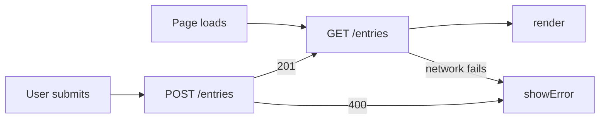

# Category Filtering: The First Delegated Feature

> Replace this title and every *italic prompt* with your own words. Six
> sections, in this order: What, See It Work, How to Run, Status, Links,
> AI Use. GitHub renders this page; it can show, not only tell.

## What

*HW4 repository: `https://github.com/rishikasikhakolli/mgt3745-hw4`

After a review is saved, the app now requires the user to tag it with one of four categories (Food, Landmark, Views, Activity), delegated to bolt.new and Google AI Studio, so the feed can be filtered down to just one category at a time. See [PROJECT.md](context/PROJECT.md) and [FEATURES.md](context/FEATURES.md). Review data now lives in Cloudflare D1 via the Worker rather than the browser (ADR-002), and category is stored server-side alongside it, not in localStorage to survive cache clears.

<!--*One paragraph naming the problem, the user, and the feature, with links to
[PROJECT.md](context/PROJECT.md) and [FEATURES.md](context/FEATURES.md).
One sentence on where data now lives and why (ADR-002).*-->

## See It Work

*A GIF or screenshot in `/docs` showing an entry surviving a cleared cache
or appearing in a second browser. Evidence and storefront at once.*

## How to Run

Deployed: `https://mgt3745-hw4.travlr.workers.dev/entries`

From a fresh Codespace:

1. Open the repository in a Codespace. The devcontainer installs xdg-utils and runs `npm install`.
2. `npx wrangler login --device`, then follow [docs/SESSION_B_COMMANDS.md](docs/SESSION_B_COMMANDS.md)
   to create the database, run the schema, and deploy.
3. Paste the deployed URL into `app.js` as `API`.
4. Right-click `index.html`, choose **Open with Live Server**.

Run the code eval: `API=https://mgt3745-hw4.travlr.workers.dev npm test`

To run the Worker locally instead: `npm run dev` (port 8787, local D1 emulator).

## Status

| Feature | EARS statement | Verdict |
|---|---|---|
| Return entries in order | THE SYSTEM SHALL return all entries in creation order. | PASS |
| Store valid entry | WHEN a valid entry is submitted, THE SYSTEM SHALL store it and confirm. | PASS |
| Reject missing text | IF the entry text is missing, THEN THE SYSTEM SHALL reject it and say why. | PASS |
| Server unreachable | IF the server cannot be reached, THEN THE SYSTEM SHALL tell the user on the page. | CANNOT TEST YET |
| Reject whitespace-only text | IF the entry text is empty or contains only whitespace, THEN THE SYSTEM SHALL reject it and say why. | PASS |
| Prompt for category before save completes | WHEN a review is saved, THE SYSTEM SHALL prompt the user to select a category from {Food, Landmark, Views, Activity}. | PASS |
| Store and display category | THE SYSTEM SHALL store the selected category with its entry and display it on the review card. | PASS |
| Filter narrows the feed | WHEN the user selects a filter, THE SYSTEM SHALL display only entries matching that category. | PASS |
| Reject invalid category | IF the category is missing or outside the allowed set, THEN THE SYSTEM SHALL reject it with a 400 error naming the allowed categories. | PASS |
| No filter shows everything | WHEN no filter is selected, THE SYSTEM SHALL display entries from all categories. | PASS |

*Full verification table lives in [FEATURES.md](context/FEATURES.md).*

## Delegation

- [DDR-001](docs/DDR-001.md): Category-Based Ranking, bolt.new, net +1.67 hours
- [DDR-002](docs/DDR-002.md): the HW4 Copilot array-position metadata bug, written up
- [Comparison note](docs/COMPARISON.md): bolt vs. AI Studio on the same prompt

## Links

Reading order for a stranger: [PROJECT.md](context/PROJECT.md) →
[USERS.md](context/USERS.md) → [FEATURES.md](context/FEATURES.md) →
[ARCHITECTURE.md](context/ARCHITECTURE.md) → [STANDARDS.md](context/STANDARDS.md) →
[TOOLS.md](context/TOOLS.md) → [STYLE.md](context/STYLE.md) →
[EVALS.md](context/EVALS.md) → [SKILLS.md](context/SKILLS.md) → [CLAUDE.md](context/CLAUDE.md)

## AI Use

Every delegation has a DDR under Delegation above. Hours spent on this assignment: ~10.
