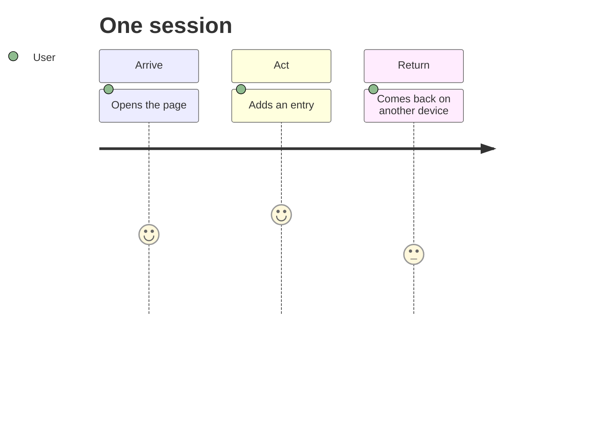

# USERS.md

## Primary user
As someone who travels casually, PROFILE-01 wants a fast way to combine all their travel highlights and updates into one place so their friends can come along the journey with them without being bombarded by frequent updates over more commonplace applications. They desire a low-pressure location to share their pictures, thoughts, and recommendations. Today, they usually text photos, stories, and specific location recommendations directly over messaging apps. This current approach is unsatisfying because sending scattered text messages is fragmented and could feel like pressure to respond for the receiver.

## Secondary user
As an active social media user who enjoys documenting their travels, they want a way to create visually appealing travel logs that match their design standards, without the image restrictions or high-pressure environment of typical platforms. They want a place to showcase highlights as curated reviews that document their trip aesthetically. They search for itinerary ideas across numerous tools and are meticulous with the photos they take of their events. Their current approach is constrained because they're limited to high-pressure sharing environments where shared thoughts are often short or nonexistent.

## Journey

